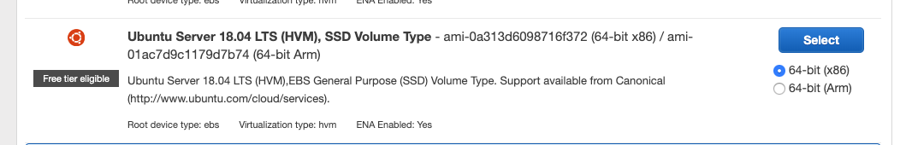

# Workshop 1: Devops & Bussines Agility


## Requisitos de Software para el taller

Para comenzar con el taller, debémos tener previamente instalados las siguientes herramientas:
 
* **Git client** ([instalar](https://git-scm.com/downloads))
* **aws-client** ([windows](https://docs.aws.amazon.com/cli/latest/userguide/install-windows.html), [MacOSX](https://docs.aws.amazon.com/cli/latest/userguide/install-macos.html), [Linux](https://docs.aws.amazon.com/cli/latest/userguide/install-linux.html))
* **Utilitario zip** ([Instalar](https://www.nchsoftware.com/zip/index.html?kw=how%20do%20you%20unzip%20a%20file%20mac&gclid=EAIaIQobChMIh9aMyqmg4QIVlYaRCh0HDAppEAAYASAAEgIi5vD_BwE))


## Comenzando con el taller

Para comenzar, vamos a bajar desde el repositorio todos los elementos necesarios para realizarlo desde un repositorio Git. Todo el material del taller se encuentra en este repositorio, por lo que se necesita tener previamente instalado el cliente Git.

Ubicación del repositorio:

```bash
git clone https://github.com/arkhotech/aws-workshop
```

Una vez descargado el repositorio procederemos a cargar el ambiente de trabajo en la nube. El ambiente se despliega desde un script de cloudformation, por lo que primero debemos hacer el setup correspondiente para que el script se pueda ejecutar.

**La primera actividad es crear un perfil para que Cloudformation pueda crear recursos:**

El script de Cloudformation necesita de un rol y una política de acceso para poder funcionar correctamente.  Cada rol debería tener asociada una política de acceso que indica las acciones que puede ejecutar el rol sobre los servicios.

#### Crear Política

Antes de crear el rol, crearemos una politica que nos de acceso a crear recursos sobre el servicio EC2, los que implican: VPC, Networking, Secguridad y recursos como instancias EC2.

Para crear la política debemos ingresar al servicio IAM:

* Seleccionar **Policies**
* Dar clic en **Create policy**, se abrirá el editor de políticas con 2 opciones de edición: **Visual editor** y **JSON**
* para este ejemplo usaremos **JSON**


* Borrar todo lo que dice hay en el editor, copiar la politica en formato JSON que se muestra a continuación y pegar en el editor:

```javascript
{
    "Version": "2012-10-17",
    "Statement": [
    	{
    		"Effect": "Allow",
    		"Action" : [
    			"ec2:*"
    		],
    		"Resource": "*"
    	}
    ]   
}
```
* El resultado debe verse como sigue:


* Dar clic en **Review policy**
* Dar el nombre **CloudFormationpolicy**


* Finalmente dar clic en **Create policy** para crear la política.

#### Crear rol y asociar política:

Arhora que la politica de ejecución para cloudformation esta creada, crear un rol.

* Ir al servicio IAM y seleccionar **Create role**
* En la siguiente pantalla:
	* En **Select type of trusted entity** dejar **AWS service**
	* Seleccionar el servicio **Cloudformation** bajo **Choose the service that will use this role**. Esto permite que cloudformation asuma el rol que estamos creando.
* Dar clic en **Next Permissions** 
* En la siguiente pantalla, escribir el nombre del rol que hemos creado anteriormente (_**cloudFormationPolicy**_), en el cuadro de texto **Filter policies**
* Dar clic en el checkbox en la política _**cloudFormationPolicy**_
* Dar clic en **Tags**. No agregaremos tags en este taller. Dar clic en **Next: Review**
* En el cuadro **Role name** agregaremos un nombre:  **cloudformationRole**
* En descripción (opcional) agregaremos algún texto descriptivo
* Dar clic en **Create role**

#### Ejecutar el script de cloudformation

* Ir al servicio "Cloudformation"
* Seleccionar "Create Stack"


* Seleccionar **"Upload a template to Amazon S3"** 


* Buscar el archivo **workshop-vpc1.yaml** ubicado en el directorio "ambiente" del repositorio que hemos descargado de Git, y luego dar clic en **"Next"**
* Llenar los campos **Stack Name**. Todos los demás campos dejarlos tal como están y dar clic en **Next**
* Dentro del Item **Permissions**, seleccionar el rol CloudformationRole (que hemos creado anteriormente)


* En la siguiente pantalla (overview), seleccionar **Create**

El proceso de creación tomará unos 2 o 3 minutos. 

#### Infraestructura

Al terminar la ejecución del script de Cloudformation, este creará la infraestructura del taller, tal como se puede ver en el siguiente diagrama:

 


# Iniciando el taller: Codedeploy

Ahora que tenemos las infraestructura procederemos a crear manualmente una instancia EC2 la cual cumplirá el rol de nuestro servidor de aplicaciones en el taller.  Este aproach será simple e irá aumentando en profundidad a lo que avanza el taller.

El objetivo de esta sección es iniciar al usuario en el despliegue automático de aplicaciones en un servidor. Para esto usaremos una instancia EC2 y Codedeploy que simulará ser nuestro servidor de aplicaciones. 
Esta instancia tendrá instalado un servicio Nginx y se desplegará una simple pagina Web de tipo "hello world" para que el usuario pueda observar algunos detalles del despliegue. Adicionalmente, a modo de introducción solo se usarán las funcionalidades mas simples de Codedeploy.

## Rol de instancia EC2

Antes de crear la instancia EC2, debemos crear un **Rol** y una **Política**. El motivo de por que se debe crear este rol es por que la instancia EC2 necesita tener acceso a S3 para interactuar con **Codedeploy**. En caso de que la instancia no tenga acceso a S3, el despliegue fallará por timeout.

### Política EC2 pra Codedeploy

Para crear la política: 

* Acceder al servicio IAM, y seleccionar Policies
* Dar clic en Create policy, se abrirá el editor de políticas con 2 opciones de edición: Visual editor y JSON
* Al igual que el rol que cremos anteriormente, usaremos JSON


* Eliminamos el contenido, copiamos el snipet que se muestra a continuación y pegamos en el editor.

```JSON
{
    "Version": "2012-10-17",
    "Statement": [
        {
            "Effect": "Allow",
            "Action": [
                "s3:*"
            ],
            "Resource": "*"
        }
    ]
}
```
* Dar clic en **Review policy**
* En el siguiente formulario agregar el no mbre **Ec2CodeployPolicy**, agregar una descripción descripción (opcional) y dar clic en **Create policy**

Ahora debemos crear el rol y asociar la politica recién creada.

### Crear Rol para EC2

* Ir al servicio IAM y dar clic en Roles.
* Luego dar clic en **Create role**
* Bajo el item que dice **_"Choose the service that will use this role"_**, seleccionar el servicio EC2. en este caso es el servicio que va a asumir ese rol.
* Dar clic en **Next Permission**.
* En el cuadro de texto **search** escribir el nombre que se le dió a la politica (Policy) creado anteriormente: **Ec2CodeployPolicy**. Dar clic en el checkbox para seleccionar.
* Dar clic en Tags. No agregaremos Tags en esta parte del taller.
* Asignamos el nombre para el nuevo rol (**Ec2CodedeployRole**) y una descripción opcional.
* Dar clic en **Create role**


### Crear una instancia EC2

Una vez creada la politica y el rol, procederemos a crear una instancia EC2 sobre la cual vamos a desplegar nuesrta aplicación.  Para realizar esta actividad:

* Ir al servicio **EC2**.
* Crear un nueva instancia **Launch instance**.
* Seleccionar: **_Ubuntu Server 18.04 LTS (HVM), SSD Volume Type - ami-0a313d6098716f372 (64-bit x86) / ami-01ac7d9c1179d7b74_** 



* Seleccionaremos una instancia de tipo **t2.micro**.
* En número de instancias, establecer en 1.
* Sobre **Network**: seleccionar la VPC que hemso creado con Cloudformation. Este debe tener el nombre Workshop 


> **NOTA:** _El nombre de la VPC se establece en el momento de ejecutar el script de cloudformation.

* Seleccionar una de las redes publicas (detallar)


* Seleccionar **Auto-asign Public IP** con el valor **enabled**


* En IAM role seleccionar el rol que creamos para esta instancia (**Ec2CodedeployRole**).


* Dejar los siguientes campos sin cambios a excepción de **Advanced Details**. 


* Abrir el item y en el cuadro **User data**, copiar el siguiente código

```bash
	#!/bin/bash 
    apt-get update

    apt-get -y install ruby wget apt-transport-https ca-certificates curl software-properties-common nfs-common default-jre
    apt-get -y install nginx
    curl -fsSL https://download.docker.com/linux/ubuntu/gpg | sudo apt-key add -

    apt-get update 

    apt-get install -y jq
    cd /home/ubuntu 
    wget https://aws-codedeploy-us-east-2.s3.amazonaws.com/latest/install 
    chmod +x ./install 
    ./install auto 
    service codedeploy-agent start
    snap install amazon-ssm-agent --classic
    systemctl start snap.amazon-ssm-agent.amazon-ssm-agent.service

```


> **NOTA:** El código que se muestra en el snipet anterior, son instrucciones que se ejecutan al momento de crear la instancia EC2 por parte de AWS, de manera que una vez que la instancia está en estado _Running_ todas las librerías y servicios ya deben estar instalados. En este caso se instalaron 2 servicios: SSM para acceso por consola AWS y el agente de Codedeploy.

* Debe quedar de la siguiente forma:


* Add Storage, y seleccione 30 en Size (GiB). Dejar los demás campos sin cambios. Dar clic en **Next: Add Tags**.


* Agregar un Tag haciendo clic en el botón **Add Tag**.
	* En la columna Key darle el nombre "Name" 
	* En la columna Value escribir "Workshop1"


* Dar clic en **Next: Configure Security Group** Configure security Group, dar clic en **Select existing Group**y dar clic en el grupo **FrontendSecurityGroup**


> **NOTA:** Este grupo se ha creado al momento de crear la infraestructura por parte del servicio de cloudformation.

* Finalmente dar clic en **Review and Launch**, y finalmente en **Launch**
* En el momento de preguntar por el Keypairs, Proceed without Keypairs y confirmar.


> **NOTA:** Este Keypair se usan para acceder a la máquina a través de SSH, pero para este taller la máquina se configurará para acceder a través del servicio SSM.

#### Agregar la política para que se pueda acceder por SSM

Ahora que tenemos la máquina EC2 lista para usar, necesitamos que esta pueda ser accedida por consola ssh.  Para esto usaremos el servicio _**Session Manager**_ que es parte de las herramientas administrativas del servicio [**AWS System Manager**](https://aws.amazon.com/systems-manager). El servicio Session Manager nos da la posibilidad de abrir sesión de consola sobre una instancia Linux, usando nuestro browser. 

Para que una instancia pueda ser accedida a través de este servicio debe cumplir con 2 requisitos:

1.- Tener instalado el **ssm-agent**. Recordar que se ha instalado al momento de crear la instancia.

2.- La máquina debe tener asociado el rol para poder acceder al servicio SSM.

Para lograr esto, asociaremos el rol que usa la instancia a la política que necesita para poder usar el servicio SSM:

* En el servicios IAM abrimos el item **Roles**.
* Buscar el rol que usa la instancia. En este caso **Ec2CodedeployRole**.
* Hacer clic en el botón **Attach policies**
* Buscar la politica **AmazonEC2RoleforSSM**, seleccionar el checkbox y dar clic en el botón **Attach policy**


### Login en la máquina EC2

Ahora probaremos el acceso a la máquina a través del servicio SSM:

* En la consola de AWS buscar el grupo **Management & Governance**.
* Seleccionar **System Manager** bajo este item.
* Una vez dentro de la consola de **System Manager**, seleccionar **Session manager**


* Se listarán las sesiones activas (no debería haber niguna). Dar clic en **Start session**


* Desde la lista, seleccionar la instancia EC2 que anteriormente hemos creado, y dar clic nuevamente en **Start session**. Esta debe abrir en el browser una sesión de consola en la instancia


Ahora vamos a revisar en la isntancia si todo esta instalado correctamente. Ejecutar en la consola los siguientes comandos:

```bash

sudo su ubuntu

cd 

ps -fea | grep ssm

#REsultado:
root       787     1  0 Mar21 ?        00:02:50 /snap/amazon-ssm-agent/1068/amazon-ssm-agent
root     30804   787  0 15:23 ?        00:00:00 /snap/amazon-ssm-agent/current/ssm-session-worker msilva-0eeec59f38b335f85
ssm-user 30814 30804  0 15:23 pts/0    00:00:00 sh
ubuntu   30852 30835  0 15:26 pts/0    00:00:00 grep --color=auto ssm
```

Revisar si el agente codedeploy esta activo

```bash

sudo service codedeploy-agent status

#El resultado debe ser el siguiente:

 codedeploy-agent.service - LSB: AWS CodeDeploy Host Agent
   Loaded: loaded (/etc/init.d/codedeploy-agent; generated)
   Active: active (running) since Thu 2019-03-21 15:39:35 UTC; 5 days ago
     Docs: man:systemd-sysv-generator(8)
    Tasks: 5 (limit: 1152)
   CGroup: /system.slice/codedeploy-agent.service
           ├─1100 codedeploy-agent: master 1100
           └─1104 codedeploy-agent: InstanceAgent::Plugins::CodeDeployPlugin::CommandPoller of master 1100

Mar 21 18:08:28 ip-10-192-10-29 su[2121]: pam_unix(su:session): session opened for user root by (uid=0)
Mar 21 18:08:28 ip-10-192-10-29 su[2121]: pam_unix(su:session): session closed for user root
Mar 25 18:24:56 ip-10-192-10-29 su[24262]: Successful su for root by root
Mar 25 18:24:56 ip-10-192-10-29 su[24262]: + ??? root:root
Mar 25 18:24:56 ip-10-192-10-29 su[24262]: pam_unix(su:session): session opened for user root by (uid=0)
Mar 25 18:24:56 ip-10-192-10-29 su[24262]: pam_unix(su:session): session closed for user root
Mar 25 18:26:14 ip-10-192-10-29 su[24317]: Successful su for root by root
Mar 25 18:26:14 ip-10-192-10-29 su[24317]: + ??? root:root
Mar 25 18:26:14 ip-10-192-10-29 su[24317]: pam_unix(su:session): session opened for user root by (uid=0)
Mar 25 18:26:15 ip-10-192-10-29 su[24317]: pam_unix(su:session): session closed for user root

```

### Check de acceso a Internet

La instancia debe tener instalado el servicio NGINX por defecto, por lo cual debería mostrar la pagina de bienvenida. para hacer este check, debemos obtener su IP publica:

* Ir al servicio EC2 y seleciccionar la máquina Workshop1 (o el nombre que se le dió al momento de crearla)
* Seleccionar Instancias
* Verificar en los detalles de la instancia el valor de **Public DNS (IpV4)**


Con el nombre DNS publico verificar si el servicio esta opertivo:   **http://public-dns**


Si se puede ver esta página, toda la instalación es un exito.

# Comenzando con Codedeploy

Nuestra primera parte del taller comenzaremos con el despliegue automático de aplicaciones, usando el servicio de Codedeploy. La primera actividad es crear una aplicación:

* Vamos al servicio Codedeploy y seleccionamos Application. La nombraremos **WorkshopSite**.
* Sobre el tipo de plataforma seleccionaremos EC2/On-Premises.

La aplicación alberga uno o mas _**Deployment Group**_ que son los que efectivamente despliegan aplicaicones. Estos usan el agente **codedeploy-agent** para realizar esta labor, por esa razón debemos asegurar que el agente este ejecutandose correctamente.

## Deployment Group

Una vez creada la aplicación, procederemos a crear nuestro primer Deployment group:

* Dentro de la aplicación, seleccionaremos **Create deployment group**


* En el campo **Deployment Group Name** le asignaremos el nombre **Website**
* Seleccionamos el Rol **CodeDeployRole** que anteriormente hemos creado.
* Seleccionar In-Place.


* Bajo environment configuration, seleccionaremos la opción **Amazon EC2 Instances**
* Para este caso, las instancias se identifican por intermedio de un Tag. El Tag que usaremos sera el nombre de instancia. Por lo tanto:
	* Usaremos el valor **Name** como Key
	* Bajo Value, usaremos el nombre de la instancia: **Workshop1** .


	
* Sobre el item **Deployment Settings**:, seleccionar AllAtOnce.
* Deshabilitar load balancer, ya que no se usará en este ejemplo.
* Dejar todos los demás valores por defecto


## Create deployment

El despliegue en esta parte del taller se originará por un cambio hecho en S3, lugar en donde subiremos nuestro código una vez empaquetado.

Al desplegar la plataforma, se ha creado un Bucket llamdo: **"s3://workshop.{id-cuenta}.edu"** 

Donde id-cuenta, es el id de la cuetna con la que se esta trabajando.

### Subir aplicación a S3

El código que usaremos se enceuntra en el reposutorio de materiales del taller que hemos bajado de Git la inicio del taller, para comenzar a preparar el código:

* Ir al directorio **site1** dentro del repositorio clonado en su máquina local.
* El repositorio clonado, debe tener la siguiente estructura:

```
site1/
     /appspec.yaml
     /src
     /restart-server.sh
```

* Dentro del repositorio local, ingresaremos al directorio **site1** y comprimiremos todo su contenido con el comando zip. Ejecutar los siguientes comandos:

```bash
cd site1
zip -r site.zip *
```
* Una vez comprimido, abrir la consola de AWS y seleccionar el servicio S3.
* Seleccionar el Bucket que se ha creado para este taller: **workshop.NNNNNNNNN.edu **(donde NNNNNN es el número de cuenta de acceso)
* Dar clic sobre el botón "upload" y subir el archivo site.zip que hemos creado anteriormente.
* Una vez subido, continuaremos con el deploy.


## Desplegar la aplicación dede S3

Ahora que la aplicación esta empaquetada y en S3, vamos a indicar a Codedeploy que queremos deseplegar la aplicación en la instancia Ec2. Para realizar esto, debemos crear una nueva **Revisión** dentro del **Deployment group**.

* Ir al servicio Codedeploy y seleccionar la aplicación **WorkshopSite**.
* Seleccionar el **Deployment group** dentro de la aplicación **WorkshopSite**. El nombre debería ser **Website**.
* Dar clic en **Deployment Group**
* Seleccionar luego el nombre del deployment group


* En el campo **Deployment group** seleccionar **Website**
* En el campo **Revision Type** seleccionar **My application is stored in Amazon S3
**
* El Location escribir:  **_s3://workship.NNNNNNN.edu/site.zip_**.   
* En **Revision file type** seleccionar el valor **.zip**
* Dar una descripción (opcional)
* Todos los demás campos dejarlos por defecto y dar clic finalmente en **Create deployment**

Una vez creado el deployment este debería pasar por los estados **In Progress** y finalmente **Succeeded**:


Aplicación desplegada:


