# Pipeline

El backbone de CI/DC es el pipeline. Este hace posible orquestar y automatizar todos los procesos que  normalmente en Devops se realizan, como por ejemplo: Build, Test & Deploy, como tareas mínimas.

En esta parte del taller realizaremos el taller de Pipeline usando el servicio de CodePipeline.

**_[Agregar pequeña descripción de AWS pipeline y sus caracteristicas en 30 líneas máximo]_**

### Setup
Antes de comenzar, crearemos los roles necesarios para que pipeline pueda usar algunos servicios a los cuales va a realizar llamados. Por ejemplo si el Pipeline va desplegar una aplicación, este debe tener permisos para ejecutar **Codedeploy**.

#### Crear Politica

crear una politica y role para ejecutar el pipeline. Esta debe tener los permisos para 

```JSON

{
    "Version": "2012-10-17",
    "Statement": [
        {
            "Effect": "Allow",
            "Action": [
                "codedeploy:*"
            ],
            "Resource": "*",
            "Condition": {
                "StringEquals": {
                    "aws:RequestedRegion": "us-east-1"
                }
            }
        }
    ]
}

```

**NOTA:** Esta politica es la misma usada en EC2, por lo que se puede utilizar para crear el rol de pipeline.

## Crear Rol para Pipeline (Revisar si es necesario)

* Ir a IAM y seleciionar Roles.
* Seleccionar create Role
* Seleciconar como servicio bajo el titulo: "Choose the service that will use this role"
* 

## Crear un nuevo pipeline

**NOTA** Es muy importante que el bucket S3 tenga activado el control de versones

* Entrar a pipeline
* Crear un nuevo pipeline, clic en **"create new pipeline"**
* Dar nu nuevo nombre al pipeline:  WorkshopWebsitePipeline
* Seleccionar "new service role"
* En **Role Name** ingresaremos el nombre: WorkshopWebsitePipelineRole
* Seleccionar custom location y seleccionar el bucket que se ha creado **workshop.nnnnnnn.edu**. Dar clic en next
* Seleccionar en source provider "S3 Bucket"
* Nuevamente seleccionar el bucket **workshop.nnnnnnn.edu**
* Em S3 dar el nombre del archivo que se va a subir a S3, site.zip u otro nombre que haya seleccionado
* En donde dice, **change detection** dejar en **cloudwatch** (explicar por que) (podría ser el resultado de otro pipeline)
* Dejar build en blanco, sleccionar skip build stage y confirmar Skip
* En depoy, seleccionar **codedeploy**
* Seleccionar la región **us-east-1**
* Seleccionar el proyeto codedeploy anteriormente creado
* seleccionar el deployment group anteriomente seleccionado
* Revisar el resumen y dar clic en "create pipeline"


Si se pueden fijar, automáticamente se ha desplegado automáticamente el archjvo que ya existía.
Podemos ejecutar manualmente un retry

* Ahora haremos una prueba desplegando un cambio y subiendolo a S3

### Aprobación

a esta altura vemos que el despliegue se realiza inmediatmente al detectarse un cambio en S3, lo que implica si es que no se ha probado o simplemente no se ha autorizado el despliegue.

* Se pueden agregar flujos de aprobación para que no se despliegue automáticamente sin antes ser aprobado por alguna persona responsable
* Para hacerlo, vamos a editar el pipeline, haciendo clic en **Edit** en la ezquina superior derecha.
* Al dar clic el pipeline entrará en modo de edición y se podrán editar cada uno de los Stages.
* Agregaremos una nuevo **Action** dentro del Stage llamado **"Deploy"**, haciendo clic sobre el boton **"Edit Stage"**

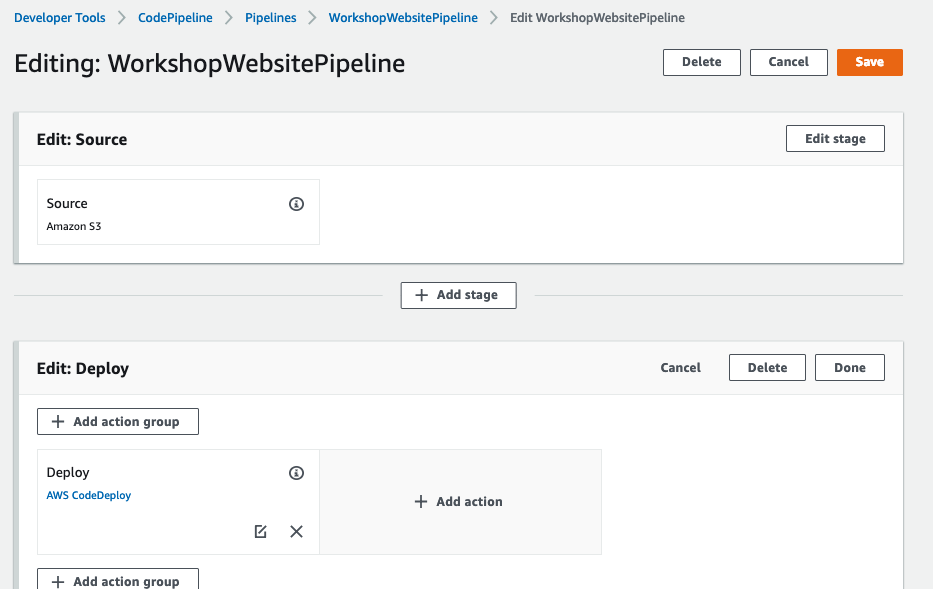

* En este punto se puede agregar acciones antes, al mismo tiempo y después de la acción de despliegue existente. 
* Para este caso vamos a agregar la acción de **Manual Aprove** antes del despliegue, de manera tal de que podamos aceptar o rechazar un despliegue cuando se produzca un nuevo cambio.
* Seleccionar el botón **"+ Add action group"** 
* Luego agregar un nombre con la cual identificar la acción. Para este caso vamos simplemente a identificarla como **"AprobarDespliegue"** (_No pueden haber espacios en los identificadores_)
* Luego seleccionaremos de la lista **"Action Provider"** una acción de tipo _**Approval**_ y luego seleccionar **_Manual Approbal_**.

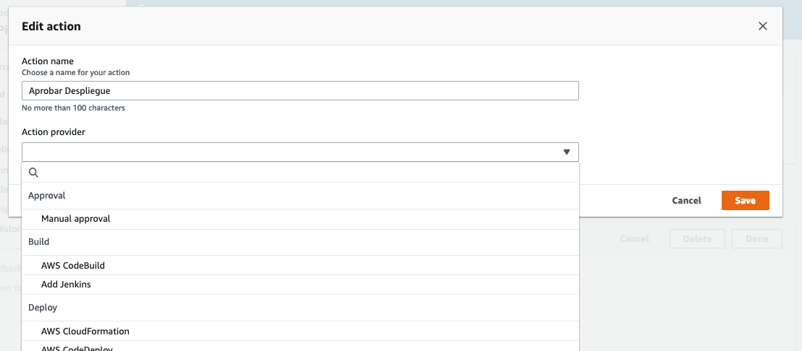

* Para la primera prueba dejaremos esto en blanco y haremos la aprobación directamente en la consola de AWS.
* Seleccionar **Save** y luego **Done** y finalmente **Save** en la esquina superior derecha.

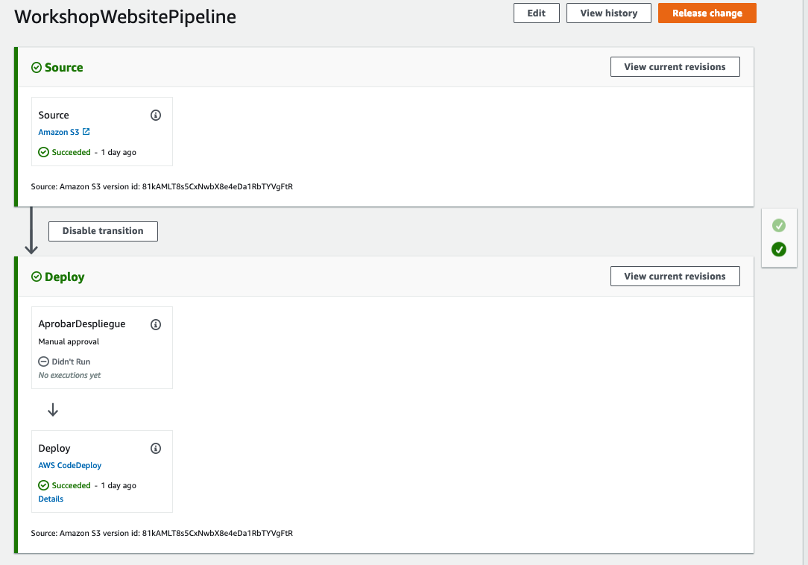

#### Configuración opcional del Maual Approve

Esta acción tiene varias formas de informar al usuario que necesita una intervención humana. Existen algunos parametros opcionales para realiazr esto:

* **"Sns Topic ARN"** Se puede usar un topic para informar de este evento y asociar a una función lambda, un Webhook, o avisar a un correo electronico de algún usuario, que se necesita de la intervención. Esto finalmente es util para generar notificaciones.  Tambien se puede usar Lambda/Slack por ejemplo.
* **URL for Review** Se puede agregar alguna URL hacia alguna aplicación para revisar lo que se requiera revisar, por ejemplo codecommit.
* **Comments** Algún comentario que se necesite agregar en la notificación.

**NOTA 1:** _**La posicición en que se agregan las acciones indican el orden en que se ejecutaran, es decir las que se ponen primero se ejecutarán antes, las que están al mismo nivel, se ejecutan simultaneamente y las que están bajo se ejecutarán después de la actividad de despliegue**_

**NOTA 2:** Queda a criterio de diseño si se agrega la aprobación en un Stage o tras una actividad. Recomendamos que esta aprobación siempre este antes de alguna actividad importante, como por ejemplo **deploy**.

### Probar la alerta

Ejecutaremos nuevamente el pipeline, esta vez en forma manual. Para realizar esto:

* Hacer clic en el botón **"Release Change"** en la ezquina superior derecha.
* El pipeline comenzará a ejecutar el Stage **"Source"**
* Esperar a que termine esta etapa y pase al Stage **"Deploy"**
* El pipeline, se detendrá la acción **AprobarDespliegue** que es la primera actividad dentro del stage Deploy.

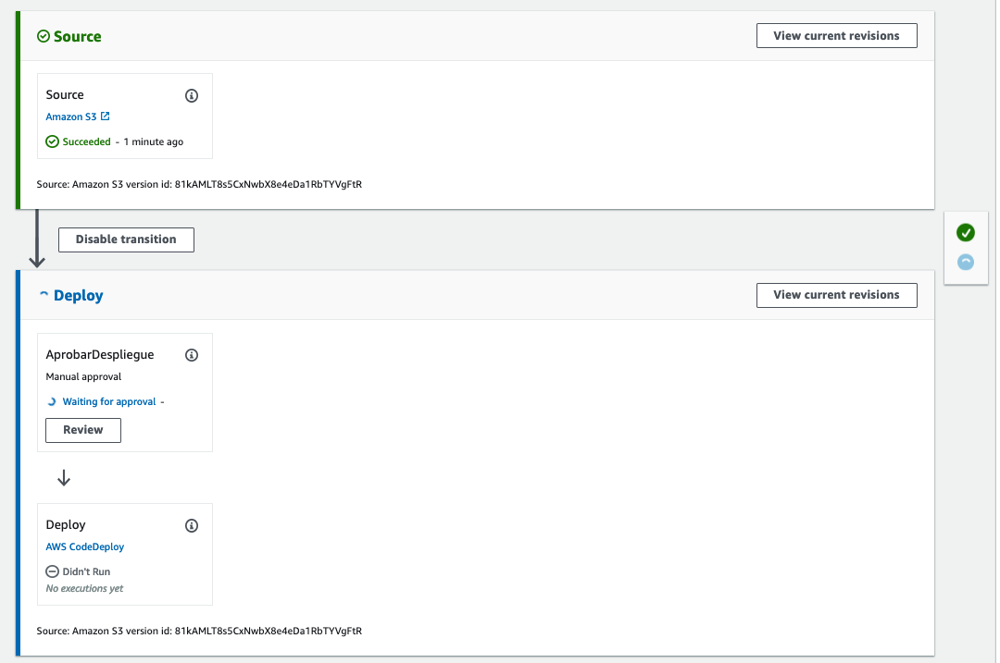

* Notar que la actividad **AprobarDespliegue** queda en estado de espera (_Waiting for Approbal_).
* Para proseguir, dar clic en **"Review"**

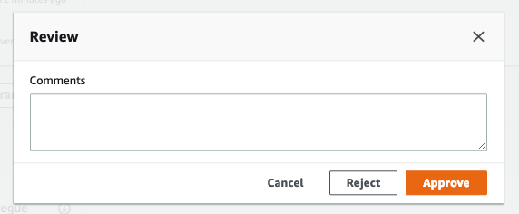

* Seleccionar "Reject" o "Approve" para proseguir.  Se debe agregar un comentario en cualquiera de los casos.

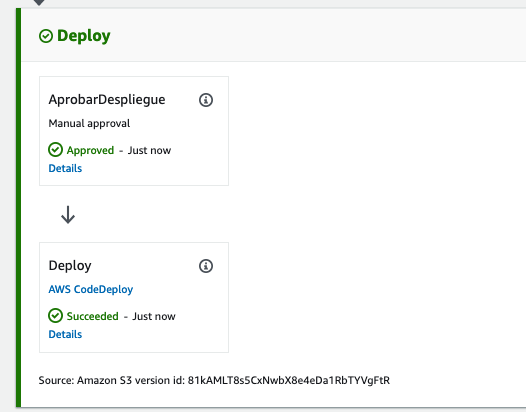

### Alertas por Mail

Se pueden generar alretas por mail usando suscripciones a Topics de tipo SNS, sobre el cual pipeline puede informar acerca de algún evento que se haya definido de interes. Una de las mas comunes y utiles es la alerta por e-mail.
Para poder generar alertas por correo se debe usar el servicio **SNS** (_Simple Notification Service_) y agregar a este topic una suscripción de correo electrónico a una cuenta o lista de distribución.


**NOTA:** El uso de SNS, no es solamente para el uso del correo exclusivamente, se pueden suscribir otros servicios tales como: mail, servicios http REST por nombrar algunos.


### Configuración de alertas de correo

**NOTA:** Pipeline debe tener permisos para publicar mensajes en SNS. Asegurar de que el rol de ejecución tenga las politicas de acceso adecuadas.  

Antes que todo, debemos crear un Topic SNS. Ingresaremos al servicio de **Simple Notification Service** y procederemos a crear un topic para nuestro pipeline:

* Ingresar al servicio SNS. Esta caerá automáticamente al Dashboard.
* Seleccionar **Topics**
* En la lista, seleccionar **Create Topic**
* En Details, dar un nombre por ejemplo **"ApprovePipeline"** y luego agregar otro identificador en "Display Name". Agregar el mismo nombre.
* Dar clic en "Create". Luego se despelgará el SNS recién creado con todas sus propiedades.

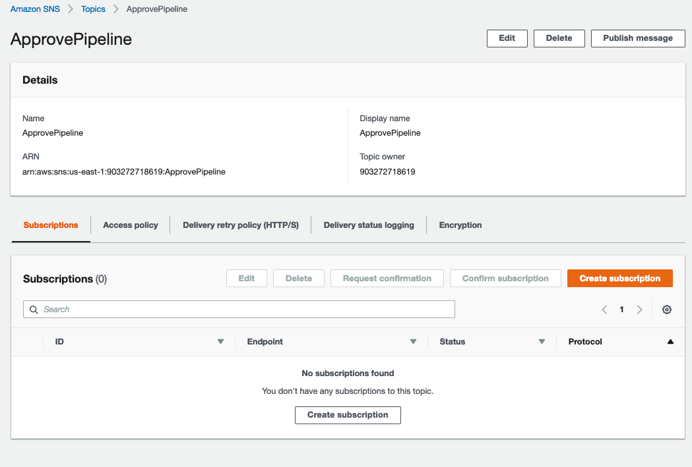

#### CRear nueva suscrición

* En este mismo formulario, dar clic en **Create Subscription**
* Dejar **Topic ARN** sin cambios.
* En la lista protocol, seleccionar Email

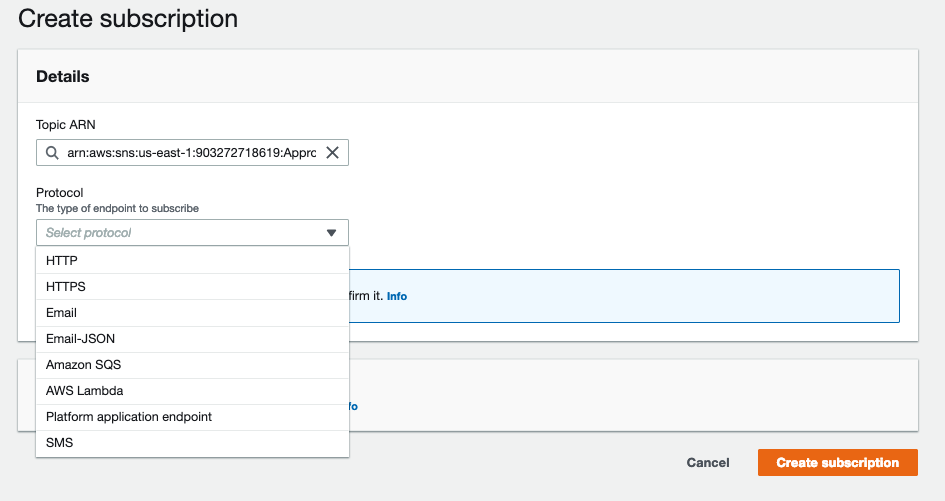

* Llenar el campo **Endpoint** con el correo a quién irán dirigidas las notificaciones
* Dar clic en **Create Subscription**. Al terminar esta acción se recibirá un correo para confirmar la subscripción

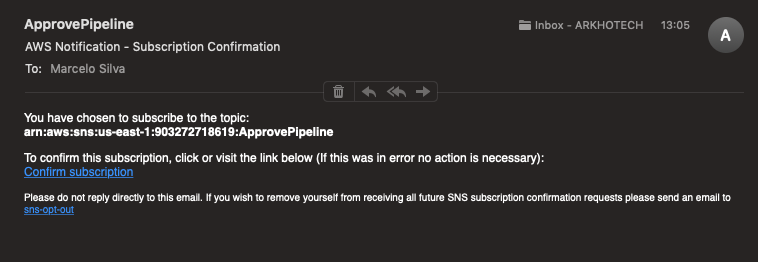

* **_Mientras no se confirme este correo, el estado de la subscripción estará en estado Pending_**

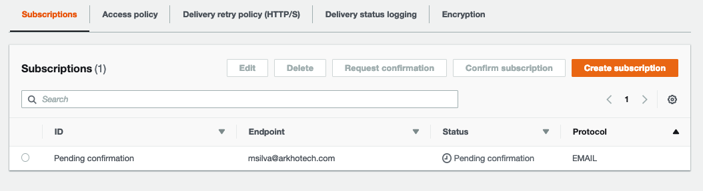

* Una vez recibido el correo, dar clic en el link **Confirm subscription**
* Al dar clic en el link se redirigirá a una URL en la cual se muestra un mensaje de éxito (o error si existe algún problema)

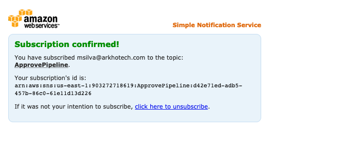

* con el mensaje anterior, podemos estar seguros de que la subscripción ha sido aprobada por el cliente y podrá recibir correos desde este Topic.
* Ahora procederemos a asociar la actividad de aprobación a este Topic.
* Retornamos al servicio **"Codepipeline"**

**NOTA:** No vamos a profundizar en este servicio específicamente, por lo que todos los demás campos quedarán por defecto.


#### Asociar SNS para notificación por correo

* Al volver al servicio de Codepipeline, edtaremos el servicio que hemos creado anteriormente.
* Dar clic en editar en la esquina superior izquierda.
* Editar el Stage **"Deploy"**
* Editar la acción Manual Approve, dando clic en el icono:  
* En la lista **SNS topic ARN** seleccionar el Topic que anteriormente hemos creado.

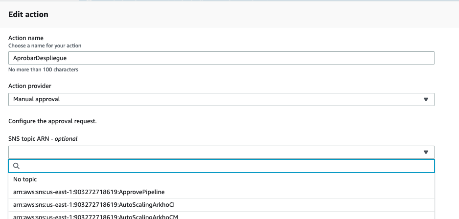

* Una vez asociado el topic SNS, dar clic en "Save" y luego guardar los cambios en el pipeline. 
* Ahora procederemos a ejecutar el pipeline, dado clic en "Relase Change" y dar clic en continuar en la advertencia
* Se repetirá el proceso y se detendrá en Approve. En ese momento debe gatillarse un correo:

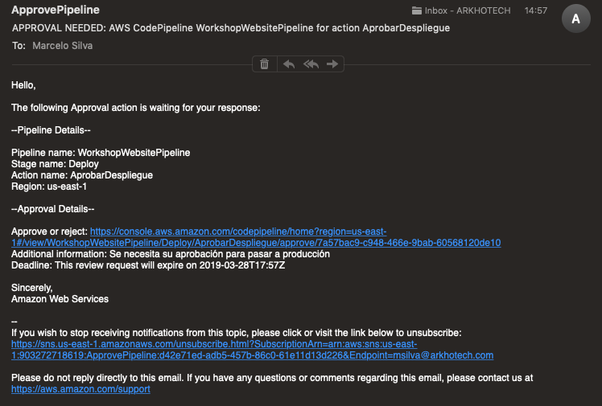

* En el correo irán varios detalles como el nombre del pipeline, el stage y se compañará con una URL donde se puede realizar la acción de aprobar o rechazar. Dar clic en la URL
* La URL llevará hacia el pipeline. En ese punto se puede acceder a la actividad de aprovación
* El método es el mismo, se debe hacer clic en **"Rewiew"**, agregar un comentario y dar clic en "Approve"
* Repetir la operación y esta vez dar clic en **Reject**

**IMPORTANTE:** Quién esta suscrito a estos correos debe tener una cuenta en AWS con acceso a la consola, permisos de lectura para Pipeline y especificamente permisos para aprobar o rechazar una actividad. 

La sioguiente politica es la que necesita tener un usuario de pipeline para poder aprobar o rechazar un despliegue con pipeline.

```JSON
{
    "Version": "2012-10-17",
    "Statement": [
        {
            "Action": [
                "codepipeline:ListPipelines"
            ],
            "Resource": [
                "*"
            ],
            "Effect": "Allow"
        },
        {
            "Action": [
                "codepipeline:GetPipeline",
                "codepipeline:GetPipelineState",
                "codepipeline:GetPipelineExecution"
            ],
            "Effect": "Allow",
            "Resource": "arn:aws:codepipeline:us-east-2:1234567890:MyFirstPipeline"
        },
        {
            "Action": [
                "codepipeline:PutApprovalResult"
            ],
            "Effect": "Allow",
            "Resource": "arn:aws:codepipeline:us-east-2:1234567890:MyFirstPipeline/MyApprovalStage/MyApprovalAction"
        }
    ]
}
```


