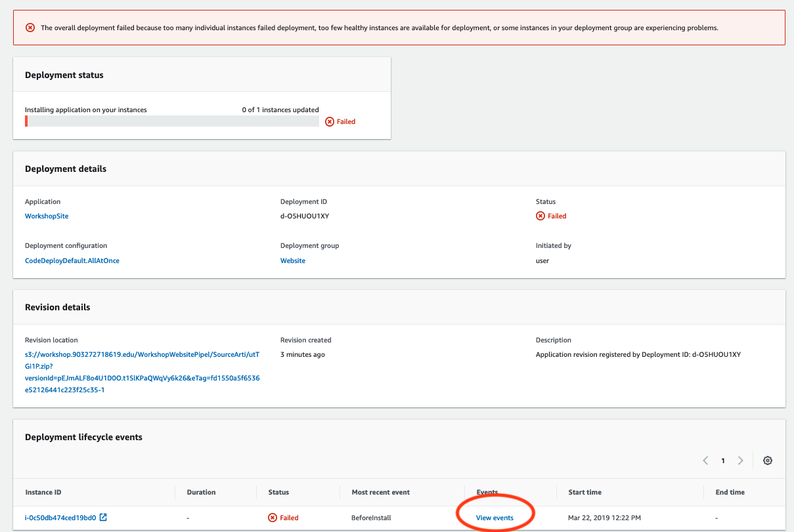

```javascript
{
	["ecr:*"]
}
```


#### Iniio del pipeline a través de eventos en Git

Un pipeline se puede iniciar a través de códigos ocurridos en Git, como por ejemplo un evento push. Pipeline tiene integración con los siguientes repositorios:

* **Codecommit**	
* **GitHub**

Para esta parte del taller usaremos el repositorio Codecommit, que es parte del Stack de desarrollo y Devops de AWS.

En primer lugar crearemos el repositorio:

* Acceder el servicio Codecommit
* Dar clic en el botón **Create repository** en la esquina superior derecha.
* Dar un nombre al repositorio en el campo **Repository name**
* Dar una descripción (Opcional) en el campo **Description**
* Una vez terminado dar clic en **Create**
* Una vez que se ha creado el repositorio, este mostrará una pantalla con un resumen de como acceder:


Como todo repositorio Git, este puede ser accedido de 2 maneras: por **https** o **ssh**. Para este caso usaremos https.

El primer paso es clonar el repositorio, para ellos es importante obtener las credenciales para el acceso.  Estas credenciales están asociadas a la cuenta de AWS, por lo que antes de clonar el repositorio procederemos a crear estas credenciales.

> **NOTA:** Codecommit esta ligado a una región específica, por lo que un repositorio creado en una región es inaccesible desde otra.

#### Crear credencuales para acceso 

* Acceder al repositorio IAM
* Acceder al nombre de usuario de la cuenta (o crear si se desea una nueva cuenta)
* dar clic en la cuenta para ver sus propiedades


* Dar acceso al ususario para que pueda acceder a codecommit. No es necesario dar acceso Full para tener control total del repositorio. Es suficiente con poweruser. Esto permitirá al usuario administrar el repositorio sin la posibilidad de borrarlo.  Para los demás un acceso de solo lectura es suficiente.

* Dar clic en **Add permissions**
* Luego seleccionar **Attach existing policies directly**
* En "filter policies" escribir "codecommit" para filtrar las politicas predeterminadas


* Una vez seleccionada la politica, dar clic en **Next Review** y posteriormente en **Add permissions**
* Al finalizar el usuario debe tener al menos esta politica asignada.


#### crear el acceso a codecommit

Una vez asignado los permisos necesarios al usuario o los usuarios que necesitan acceder a codecommit, se debe crear la credencial de acceso.

> **NOTA:** Esta credencial es solo para accder a través de **HTTPS**.

* Seleccionar el usuario y en la pagina de "Summary" seleccionar **Security credentials**
* Buscar el item **HTTPS Git credentials for AWS CodeCommit** y dar clic en **Generate**


* Las credenciales de acceso se generarán y se asignará un nombre de usuario y una clave de acceso. _La clave de acceso esta oculta, por lo que para verla se debe dar clic en el link **Show**_
* Tambien se puede dar clic en **Download Credentials** (Recomendado) para tener un archivo CSV con los datos.


Hasta este punto estamos en condiciones de poder usar codecomit.

#### Clonar el repositorio

Para clonar un repositorio de Codecommit, se puede usar el cliente de Git standar, cualquier que el usuario tenga instalado. Para este ejemplo usaremos la interfaz de comandos.

> **NOTA:** Es importante antes de clonar el repositorio, tener configurado el AWS cliente y el profile apuntando a la cuenta con la cual estamos trabajando. Sino esta hecho aún por favor configurar acá: [Instalar AWS client](aws_client.md)

* Clonar el repositorio:

```bash
git clone https://git-codecommit.us-east-1.amazonaws.com/v1/repos/workshop1
Marcelos-MacBook-Pro:~ msilva$ git clone https://git-codecommit.us-east-1.amazonaws.com/v1/repos/workshop1
Cloning into 'workshop1'...

The config profile (CodeCommitProfile) could not be found
Username for 'https://git-codecommit.us-east-1.amazonaws.com/v1/repos/workshop1': 
Password for 'https://git-codecommit.us-east-1.amazonaws.com/v1/repos/workshop1': 

botocore.exceptions.ProfileNotFound: The config profile (arkho) could not be found
warning: You appear to have cloned an empty repository.
```
> **NOTA:** El repositorio una vez clonado esta vacio, por lo que hay que inicializarlo

#### Inicializar el repositorio
```bash
#El directorio que se crea tiene el nombre del repositorio
> cd workshop1
> git init
> echo "# Reame" > README.md
> git add README.md
> git commit -m 'Inicialización del repo'
 1 file changed, 1 insertion(+)
 create mode 100644 README.md
> git push origin master
Counting objects: 3, done.
Writing objects: 100% (3/3), 238 bytes | 238.00 KiB/s, done.
Total 3 (delta 0), reused 0 (delta 0)
To https://git-codecommit.us-east-1.amazonaws.com/v1/repos/workshop1
 * [new branch]      master -> master
```

Hasta aquí, ya tenemos nuestro repositorio inicializado.  Por lo que podemos continuar con nuestro proyecto.

### Aplicación 2

Para esta parte del taller vamos a trabajar con codecommit, con un proyecto simple que se inicia a través de un evento push gatillado por codecommit
La primera actividad es copiar desde el repositorio del taller, en el directorio app1 y app2 hacia el nuevo repositorio llamado _workshop1_.
Adicionalmente vamos a copiar el archivo appspec.yml en la raíz del directorio _workshop1_

Las actividades que se realizarán en esta parte del taller son:

1. Modificar el pipeline para que responda a eventos de **pull** en codecommit. Los cambios se harán directamente sobre master por motivos de facilitar el taller. 
2. Usar la aplicación Web anterior para que se despliegue automáticamente cuando se genere un evento push en codecommit y este inicie automáticamente el pipeline.
4. Modificar el archivo appspec.yml para adecuarlo a la nueva estructura de archivos.

> **NOTA:** Recomendamos usar [Gitflow](https://datasift.github.io/gitflow/IntroducingGitFlow.html) para administrar el flujo de cambios dentro de un repositorio git. 

#### Modificar el pipeline

* Dirigirse al servicio pipeline y selccionar el pipeline de nuestro proyecto **WorkshopWebsitePipeline**
* Dar clic para desplegar el pipeline
* Editar: dar clic en **Edit**
* Editar el stage **Source** dando clic en el botón **Edit stage**
* Editar la actividad llamada **Source** dando clic en el icono de edicion 
* Seleccionar en **Action Provider**, AWS Codecommit bajo el item Source


*  En las opciones **Repository Name** y **Branch Name**, agregar el nombre del repositorio **workshop1** y el branch **master** respectivamente. Estas opciones ya deberían estar en la lista


> **NOTA:** Tomar en cuenta que, sí las opciones no se ven en las listas, entonces o el repositorio no existe o esta en otra reión

* _Dejar que quién controla los eventos séa Cloudwatch_
* Dar clic en save, luego **Done** en el stage y finalmente **Save** en la esquina superior derecha para guardar los cambios en el pipeline.
* Se mostrará un cuadro informativo. este cuadro informará que se eliminará el evento de cambio asociado a S3 y asociará un nuevo evento de cambio sobre el repositorio y rama seleccionado en codecommit. Dar clic en **Save**


Ahora se está en condiciones de iniciar el despliegue. Notese que este automáticamente iniciará un evento de cambio. Si se autoriza, este debería fallár.


Esto sucede por que en el repositorio codedeploy no encuentra el archivo **appspec.yml**. Para revisar dar clic en details en la actividad **Deploy**, leugo en el recuadro que se muestra, dar clic en el link **Link to execution details**



* Al dar clic en **View Events**


> **IMPORTANTE:** Este error ha sido pensado en forma deliverada para efectos del taller. Este método no debe ser usado para ambientes productivos, para ello ya el método de trabajo con todas las herramientas debe estar aterrizado y probado.  Esta es una de las razones de las actividades de aprobación manual.


#### Copiar la aplicación Web

Proseguiremos con el taller y normalizaremos el nuevo repositorio para poder trabajar con codecommit. Para ello:

* Copiar el directorio desde el antiguo repositorio hacia el nuevo (codecomit)

```bash
cp aws-workshop/site1/ workshop1/app1
cd workshop1
cp app1/appspect.yml .
mkdir scripts
cp app1/restart-server.sh scripts
```

* Ahora procedemos a modificar el appspect.yml.

> La razón por la cual se modifica el appspec.yml es para que codedeploy pueda ejecutar la tarea de despigue.

* Editaremos el archivo appspec.yml para adaptar las nuevas rutas que tiene el nuevo repositorio.

```yaml
version: 0.0
os: linux
files:
#Ahora en la nueva estructura site1 esta dentro de app1 y appspec.yml esta en la raíz.
  - source: /app1/src 
    destination: /var/www/html   # Este indica el directorio dentro de la instancia

hooks:
  ApplicationStart:
    - location: scripts/restart-server.sh
      timeout: 15
      runas: root
```

* Finalmente el repositorio debería verse:

> /
> > appspec.yml
> > script
> > > restart-server.sh
> > app1
> > > src
> > > > index.html


* Ahora estamos en condiciones de proseguir. Guardaremos los cambios y procederemos a subir los cambios. Dentro del nuevo repositorio **workshop1**

```bash
git add *
git commit -m 'nuevo repositorio'
git push origin master
```


### Formato de la imagen ECS:

{{ACCOUNT_ID}}.dkr.ecr.us-east-1.amazonaws.com/workshop1

Construir la imagen que se usará en el servicio

```
docker build . -t 1234567890.dkr.ecr.us-east-1.amazonaws.com/workshop1
```

La imagen ahora se comanzará a construir a partir del archivo Dockerfile. Esta será nuestra imagen base

```bash
Sending build context to Docker daemon  2.048kB
Step 1/1 : FROM java
latest: Pulling from library/java
5040bd298390: Pull complete 
fce5728aad85: Pull complete 
76610ec20bf5: Pull complete 
60170fec2151: Pull complete 
e98f73de8f0d: Pull complete 
11f7af24ed9c: Pull complete 
49e2d6393f32: Pull complete 
bb9cdec9c7f3: Pull complete 
Digest: sha256:c1ff613e8ba25833d2e1940da0940c3824f03f802c449f3d1815a66b7f8c0e9d
Status: Downloaded newer image for java:latest
 ---> d23bdf5b1b1b
Successfully built d23bdf5b1b1b
Successfully tagged 903272718619.dkr.ecr.us-east-1.amazonaws.com/workshop1:latest
```
Subir la imagen al repositoreio ECS con el comando docker push:

```bash
$(aws ecr get-login --no-include-email --region us-east-1)
docker push  903272718619.dkr.ecr.us-east-1.amazonaws.com
```


#### Crear usuaurio para Devops con acceso a cliente


