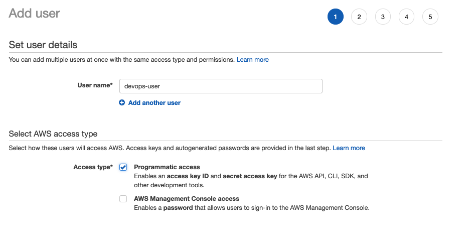

#Apendice A


### Formato de la imagen ECS:

{{ACCOUNT_ID}}.dkr.ecr.us-east-1.amazonaws.com/workshop1

Construir la imagen que se usará en el servicio

```
docker build . -t 1234567890.dkr.ecr.us-east-1.amazonaws.com/workshop1
```

La imagen ahora se comanzará a construir a partir del archivo Dockerfile. Esta será nuestra imagen base

```bash
Sending build context to Docker daemon  2.048kB
Step 1/1 : FROM java
latest: Pulling from library/java
5040bd298390: Pull complete 
fce5728aad85: Pull complete 
76610ec20bf5: Pull complete 
60170fec2151: Pull complete 
e98f73de8f0d: Pull complete 
11f7af24ed9c: Pull complete 
49e2d6393f32: Pull complete 
bb9cdec9c7f3: Pull complete 
Digest: sha256:c1ff613e8ba25833d2e1940da0940c3824f03f802c449f3d1815a66b7f8c0e9d
Status: Downloaded newer image for java:latest
 ---> d23bdf5b1b1b
Successfully built d23bdf5b1b1b
Successfully tagged 903272718619.dkr.ecr.us-east-1.amazonaws.com/workshop1:latest
```
Subir la imagen al repositoreio ECS con el comando docker push:

```bash
$(aws ecr get-login --no-include-email --region us-east-1)
docker push  903272718619.dkr.ecr.us-east-1.amazonaws.com
```


#### Crear usuaurio para Devops con acceso a cliente


